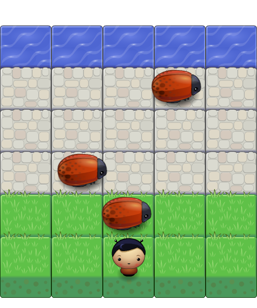

## Arcade Game Clone
===============================

This is a clone of the classic arcade game Frogger.  The game engine was provided by Udacity. I provided the logic for the game in app.js. The goal was to practice object oriented JavaScript by creating classes which use prototypal inheritance.

# Getting Started

To play the game locally clone this repository and open index.html in your broswer. Or you can play via [Github Pages](https://wahula4.github.io/frontend-nanodegree-arcade-game/)

Use the arrow keys to move your player up, down, left, and right.
The goal is to get your player to the water without colliding with a bug.

Future implementations will be adding scoring and items for the player to collect.